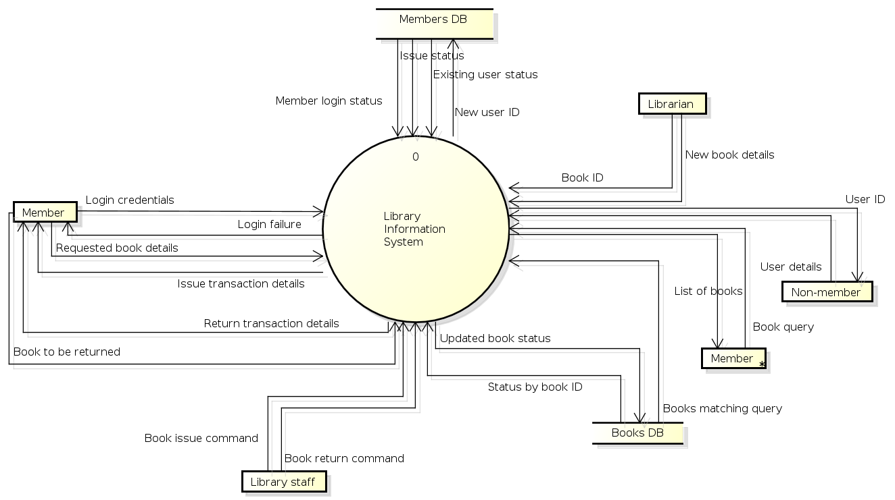
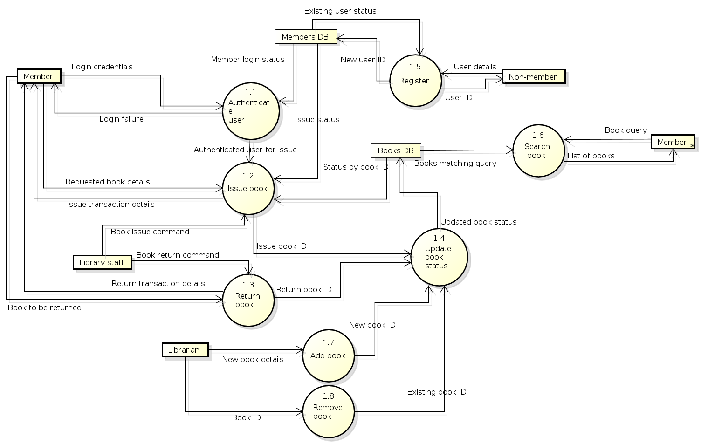

## Case Study

**A Library Information System for SE VLabs Institute**

The SE VLabs Institute has been recently setup to provide state-of-the-art research facilities in the field of Software Engineering. Apart from research scholars (students) and professors, it also includes quite a large number of employees who work on different projects undertaken by the institution.

As the size and capacity of the institute is increasing with the time, it has been proposed to develop a Library Information System (LIS) for the benefit of students and employees of the institute. LIS will enable the members to borrow a book (or return it) with ease while sitting at his desk/chamber. The system also enables a member to extend the date of his borrowing if no other booking for that particular book has been made. For the library staff, this system aids them to easily handle day-to-day book transactions. The librarian, who has administrative privileges and complete control over the system, can enter a new record into the system when a new book has been purchased, or remove a record in case any book is taken off the shelf. Any non-member is free to use this system to browse/search books online. However, issuing or returning books is restricted to valid users (members) of LIS only.

The final deliverable would a web application, which should run only within the institute LAN. Although this reduces security risk of the software to a large extent, care should be taken no confidential information (eg., passwords) is stored in plain text.

Figure 1 shows the context-level DFD for LIS. The entire system is represented with a single circle (process). The external entities interacting with this system are members of LIS, library staff, librarian, and non-members of LIS. Two database are used to keep track of member information and details of books in the library.

Let us focus on the external entity, Member. In order to issue or return books a member has to login to the system. The data flow labeled with "Login credentials" indicate the step when a member authenticates himself by providing required information (user ID, password). The system in turn verifies the user credentials using information stored in the members database. If all information are not provided correctly, the user is shown a login failure message. Otherwise, the user can continue with his operation. Note that a DFD does not show conditional flows. It can only summarize the information flowing in and out of the system.

The data flow with the label "Requested book details" identify the information that the user has to provide in order to issue a book. LIS checks with the books database whether the given book is available. After a book has been issued, the transaction details is provided to the member.

 Figure-01: Context-level DFD for Library Information System

The level-1 DFD is shown in figure 2. Here, we split the top-level view of the system into multiple logical components. Each process has a name, and a dotted-decimal number in the form 1.x. For example, the process "Issue book" has the number 1.2, which indicates that in the level 1 DFD the concerned process is numbered 2. Other processes are numbered in a similar way.

 Figure-02: Level 1 DFD for Library Information System

Comparing figures 1 and 2 one might observe that the information flow in and out of LIS has been preserved. We observe in figure 2 that the sub-processes themselves exchange information among themselves. These information flows would be, in turn, preserved if we decompose the system into a level 2 DFD.

Finally, in order to eliminate intersecting lines and make the DFD complex, the Member external entity has been duplicated in figure 2. This is indicated by a * mark near the right-bottom corner of the entity box.