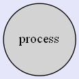
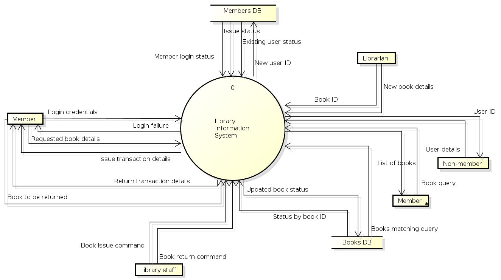
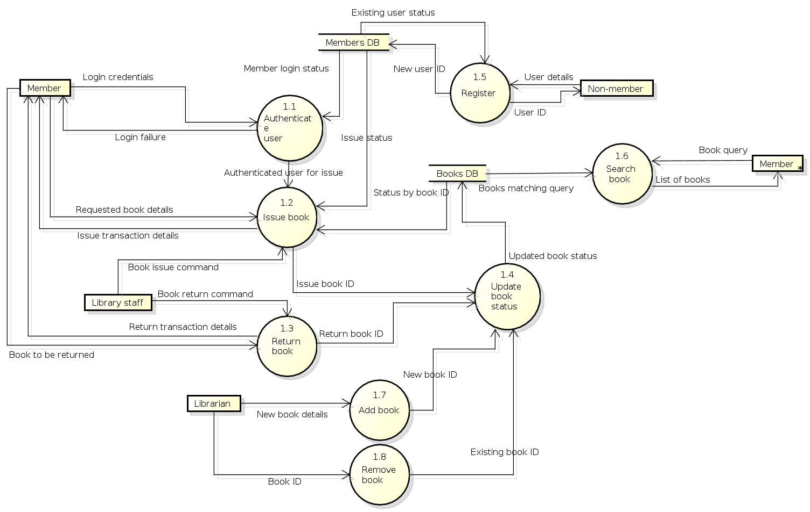

## Introduction 

Information Systems (IS) help in managing and updating the vast business-related information. Before designing such an IS, it is helpful to identify the various stakeholders, and the information that they would be exchanging with the system. An IS, however, is a large software comprised of several modules, which, in turn, share the process the available data. These data are often stored in databases for further references. A Data Flow Diagram (DFD) is used to pictorially represent the functionalities of the ISs by focusing on the sources and destinations of the data flowing in the system.

 

## Theory

### Data Flow Diagram

DFD provides the functional overview of a system. The graphical representation easily overcomes any gap between ’user and system analyst’ and ‘analyst and system designer’ in understanding a system. Starting from an overview of the system it explores detailed design of a system through a hierarchy. DFD shows the external entities from which data flows into the process and also the other flows of data within a system. It also includes the transformations of data flow by the process and the data stores to read or write a data.

### Graphical notations for Data Flow Diagram

Term | Notation | Remarks |
:--|:--|:--|
External entity |  |Name of the external entity is written inside the rectangle
Process|  |Name of the process is written inside the circle
Data store|  |A left-right open rectangle is denoted as data store; name of the data store is written inside the shape
Data flow|  |Data flow is represented by a directed arc with its data name

### Explanation of Symbols used in DFD
- **Process**: Processes are represented by circle. The name of the process is written into the circle. The name of the process is usually given in such a way that represents the functionality of the process. More detailed functionalities can be shown in the next Level if it is required. Usually it is better to keep the number of processes less than 7 [i]. If we see that the number of processes becomes more than 7 then we should combine some the processes to a single one to reduce the number of processes and further decompose it to the next level [2] .
- **External entity**: External entities are only appear in context diagram[2]. External entities are represented by a rectangle and the name of the external entity is written into the shape. These send data to be processed and again receive the processed data.
- **Data store**: Data stares are represented by a left-right open rectangle. Name of the data store is written in between two horizontal lines of the open rectangle. Data stores are used as repositories from which data can be flown in or flown out to or from a process.
- **Data flow**: Data flows are shown as a directed edge between two components of a Data Flow Diagram. Data can flow from external entity to process, data store to process, in between two processes and vice-versa.

### Context diagram and leveling DFD

We start with a broad overview of a system represented in level 0 diagram. It is known as context diagram of the system. The entire system is shown as single process and also the interactions of external entities with the system are represented in context diagram.
Further we split the process in next levels into several numbers of processes to represent the detailed functionalities performed by the system. Data stores may appear in higher level DFDs.
**Numbering of processes** : If process ‘p’ in context diagram is split into 3 processes ‘p1’, ‘p2’and ‘p3’ in next level then these are labeled as 0.1, 0.2 and 0.3 in level 1 respectively. Let the process ‘p3’ is again split into three processes ‘p31’, ‘p32’ and ‘p33’ in level 2, so, these are labeled as 0.3.1, 0.3.2 and 0.3.3 respectively and so on.
**Balancing DFD**: The data that flow into the process and the data that flow out to the process need to be match when the process is split into in the next level. This is known as balancing a DFD.

See simulation and case study of the experiment to understand data flow diagram in more real context.

**Note :**

1. External entities only appear in context diagram i.e, only at level 0.
2. Keep number of processes at each level less than 7.
3. Data flow is not possible in between two external entities and in between two data stores.
4. Data cannot flow from an External entity to a data store and vice-versa.

## Case Study

**A Library Information System for SE VLabs Institute**

The SE VLabs Institute has been recently setup to provide state-of-the-art research facilities in the field of Software Engineering. Apart from research scholars (students) and professors, it also includes quite a large number of employees who work on different projects undertaken by the institution.

As the size and capacity of the institute is increasing with the time, it has been proposed to develop a Library Information System (LIS) for the benefit of students and employees of the institute. LIS will enable the members to borrow a book (or return it) with ease while sitting at his desk/chamber. The system also enables a member to extend the date of his borrowing if no other booking for that particular book has been made. For the library staff, this system aids them to easily handle day-to-day book transactions. The librarian, who has administrative privileges and complete control over the system, can enter a new record into the system when a new book has been purchased, or remove a record in case any book is taken off the shelf. Any non-member is free to use this system to browse/search books online. However, issuing or returning books is restricted to valid users (members) of LIS only.

The final deliverable would a web application, which should run only within the institute LAN. Although this reduces security risk of the software to a large extent, care should be taken no confidential information (eg., passwords) is stored in plain text.

Figure 1 shows the context-level DFD for LIS. The entire system is represented with a single circle (process). The external entities interacting with this system are members of LIS, library staff, librarian, and non-members of LIS. Two database are used to keep track of member information and details of books in the library.

Let us focus on the external entity, Member. In order to issue or return books a member has to login to the system. The data flow labeled with "Login credentials" indicate the step when a member authenticates himself by providing required information (user ID, password). The system in turn verifies the user credentials using information stored in the members database. If all information are not provided correctly, the user is shown a login failure message. Otherwise, the user can continue with his operation. Note that a DFD does not show conditional flows. It can only summarize the information flowing in and out of the system.

The data flow with the label "Requested book details" identify the information that the user has to provide in order to issue a book. LIS checks with the books database whether the given book is available. After a book has been issued, the transaction details is provided to the member.

 Figure-01: Context-level DFD for Library Information System

The level-1 DFD is shown in figure 2. Here, we split the top-level view of the system into multiple logical components. Each process has a name, and a dotted-decimal number in the form 1.x. For example, the process "Issue book" has the number 1.2, which indicates that in the level 1 DFD the concerned process is numbered 2. Other processes are numbered in a similar way.

 Figure-02: Level 1 DFD for Library Information System

Comparing figures 1 and 2 one might observe that the information flow in and out of LIS has been preserved. We observe in figure 2 that the sub-processes themselves exchange information among themselves. These information flows would be, in turn, preserved if we decompose the system into a level 2 DFD.

Finally, in order to eliminate intersecting lines and make the DFD complex, the Member external entity has been duplicated in figure 2. This is indicated by a * mark near the right-bottom corner of the entity box.

