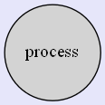

## Objectives

**After completing this experiment you will be able to:**

- Identify external entities and functionalities of any system
- Identify the flow of data across the system
- Represent the flow with Data Flow Diagrams
 

## Theory

### Data Flow Diagram

DFD provides the functional overview of a system. The graphical representation easily overcomes any gap between ’user and system analyst’ and ‘analyst and system designer’ in understanding a system. Starting from an overview of the system it explores detailed design of a system through a hierarchy. DFD shows the external entities from which data flows into the process and also the other flows of data within a system. It also includes the transformations of data flow by the process and the data stores to read or write a data.

### Graphical notations for Data Flow Diagram

Term | Notation | Remarks |
:--|:--|:--|
External entity |  |Name of the external entity is written inside the rectangle
Process|  |Name of the process is written inside the circle
Data store|  |A left-right open rectangle is denoted as data store; name of the data store is written inside the shape
Data flow|  |Data flow is represented by a directed arc with its data name

### Explanation of Symbols used in DFD
- **Process**: Processes are represented by circle. The name of the process is written into the circle. The name of the process is usually given in such a way that represents the functionality of the process. More detailed functionalities can be shown in the next Level if it is required. Usually it is better to keep the number of processes less than 7 [i]. If we see that the number of processes becomes more than 7 then we should combine some the processes to a single one to reduce the number of processes and further decompose it to the next level [2] .
- **External entity**: External entities are only appear in context diagram[2]. External entities are represented by a rectangle and the name of the external entity is written into the shape. These send data to be processed and again receive the processed data.
- **Data store**: Data stares are represented by a left-right open rectangle. Name of the data store is written in between two horizontal lines of the open rectangle. Data stores are used as repositories from which data can be flown in or flown out to or from a process.
- **Data flow**: Data flows are shown as a directed edge between two components of a Data Flow Diagram. Data can flow from external entity to process, data store to process, in between two processes and vice-versa.

### Context diagram and leveling DFD

We start with a broad overview of a system represented in level 0 diagram. It is known as context diagram of the system. The entire system is shown as single process and also the interactions of external entities with the system are represented in context diagram.
Further we split the process in next levels into several numbers of processes to represent the detailed functionalities performed by the system. Data stores may appear in higher level DFDs.
**Numbering of processes** : If process ‘p’ in context diagram is split into 3 processes ‘p1’, ‘p2’and ‘p3’ in next level then these are labeled as 0.1, 0.2 and 0.3 in level 1 respectively. Let the process ‘p3’ is again split into three processes ‘p31’, ‘p32’ and ‘p33’ in level 2, so, these are labeled as 0.3.1, 0.3.2 and 0.3.3 respectively and so on.
**Balancing DFD**: The data that flow into the process and the data that flow out to the process need to be match when the process is split into in the next level. This is known as balancing a DFD.

See simulation and case study of the experiment to understand data flow diagram in more real context.

**Note :**

1. External entities only appear in context diagram i.e, only at level 0.
2. Keep number of processes at each level less than 7.
3. Data flow is not possible in between two external entities and in between two data stores.
4. Data cannot flow from an External entity to a data store and vice-versa.

